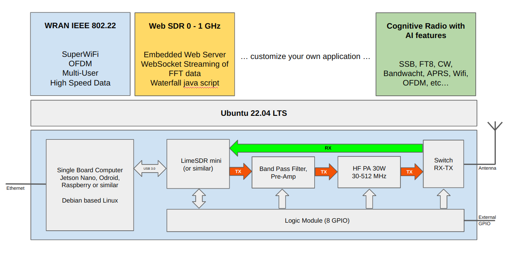

<table style="border:0" style="width:100%">
 <tr>
  <td></td>
    <td>
    <b>Open SDR Platform</b>  
         Austria: 
        OE3BIA, OE9RIR, OE9RWV, Fabian (OE9xxx)  
         France:          
        F4VVO  
        Web: <a href="https://rpx-100.net">www.rpx-100.net</a> 
        </td>
        <td align="center">
          
        
    </td>
 </tr>
</table>

<h1>Overview</h1>
WRAN (Wireless Regional Area Network) is a new digital radio transmission mode (Super Wi-Fi) developed by Radio Amateurs in Austria allowing high speed data communication in Sub-GHz Frequency bands.  
Requirements for the new communication system are to support sufficient bandwidth for each user, and to enable multiple users at the same time to connect to a base station.
The implementation of the new digital transmission mode is based on the concept of a software defined radio using the LimeSDR ecosystem and the builds on the IEEE 802.22 standard. The Open SDR Platform addresses developers building software for radio communication and integrates artificial intelligence (AI) into radio transmission and propagation.  
Hardware and software are designed as kit, the RPX-100, which allows a modular use and supports all possible Sub-GHz frequency bands.  

<h1>RPX-100 Transceiver Kit</h1>
The RPX-100 is a modular kit for a software defined transceiver using standard embedded boards running linux such as the Odroid C4 or the Jetson Nano.
Most common Software Defined Radios with USB interface are supported, the kit comes with the LimeSDR mini 2.0. It includes a Radio Frontend with software defined band pass filters and a class A amplifier with output power of 25W and is designed to operate on all Sub GHz Frequencies.  

The RPX-100 can be supplied with 9-24V to allow any mobile or fixed power supply. Interfaces such as GPIO, display boards, etc. are available for optional add-ons such as display, Microphone or buttons and keyboard. Alternatively a Raspberry Compute Module 4 or the Odroid C4 can be used as embedded CPU.

The source code for this project can be found in the following repositories on GitHub:

<ul>
<li>WRAN Project Website (https://rpx-100.net):  <a href="https://github.com/WRAN-OEVSV/Website" target="_blank">https://github.com/WRAN-OEVSV/Website</a></li>
<li>WRAN - IEEE802.22 Application for RPX-100: <a href="https://github.com/WRAN-OEVSV/802_22_Base" target="_blank">https://github.com/WRAN-OEVSV/802_22_base</a></li>
<li>WebSDR for RPX-100: <a href="https://github.com/WRAN-OEVSV/WebSDR" target="_blank">https://github.com/WRAN-OEVSV/WebSDR --> Integration into base ongoing</a></li>
</ul>

Before compiling the code on the embedded device the following dependencies need to be installed manually:

<ul>
<li>automake</li>
<li>autoconf</li>
<li>build-essentials</li>
<li>cmake (latest versions or > 3.x</li>
<li>gdb</li>
<li>rsync</li>
<li>libssl</li>
</ul>

Cloning for embedded devices has to be done recursive: `git clone --recursive git@github.com:isemann/RPX-100.git`
In the directory of the cloned source code do: `mkdir build && cd build && cmake .. && make`